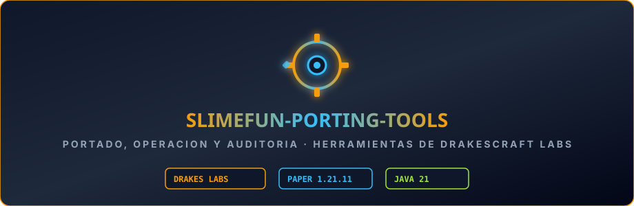

<p align="center"></p>

# Herramientas de portado de addons de Slimefun

> ### 🏰 ¡Únete a la Comunidad Oficial de DrakesCraft!
> 
> * 🎮 **IP del Servidor**: `play.drakescraft.cl` *(Java 1.21.11 & Bedrock)*
> * 💬 **Discord Oficial**: [discord.gg/drakescraft](https://discord.gg/rR7FbfCt9Y)
> * 🌐 **Web & Guía**: [web.drakescraft.cl](https://web.drakescraft.cl) — 🛒 **Tienda**: [web.drakescraft.cl/store](https://web.drakescraft.cl/store.html)
> 
> *¡Juega con este addon y más de 80 expansiones optimizadas en vivo en nuestra network de supervivencia técnica!*

---

Lo que usamos en **DrakesCraft** para traer addons de Slimefun de fuera —muchos de 2021-2022 y
casi todos del ecosistema chino— a nuestro core: **Paper/Purpur 1.21.11, Java 21**.

No son scripts de usar y tirar. Cada trampa que nos costó un despliegue fallido acabó aquí
dentro, para no volver a pisarla.

## El problema de fondo

El core de DrakesCraft (`Slimefun4-Drake`) repaquetó Slimefun. Cualquier addon de fuera compila
contra los nombres de upstream y **no encuentra ni una clase**. El mapeo real, comprobado leyendo
las declaraciones `package` del propio core, es este — y tres de las cuatro líneas engañan:

```
io.github.thebusybiscuit        →  com.github.drakescraft_labs
me.mrCookieSlime.Slimefun       →  com.github.drakescraft_labs.slimefun4.legacy
me.mrCookieSlime.CSCoreLibPlugin                        (sin cambios)
io.github.bakedlibs.dough       →  com.github.drakescraft_labs.slimefun4.libraries.dough
```

**El segmento `Slimefun` desaparece.** En el árbol de ficheros la carpeta se sigue llamando
`legacy/Slimefun/`, pero dentro los ficheros declaran `legacy.Objects...` y `legacy.api...`.
Guiarse por las carpetas y no por los `package` deja un prefijo que no existe.

**`CSCoreLibPlugin` se movió de carpeta pero no se repaquetó**, así que sus clases siguen
llamándose igual de verdad.

**Y dough es la más traicionera**: el core compila contra `dev.drake.dough`, pero al empaquetar el
shade la relocaliza. Lo que ve un addon en el jar publicado es `slimefun4.libraries.dough`, ni una
cosa ni la otra.

## Las herramientas

### `portar.py`
El grueso. Reescribe los paquetes en las fuentes y deja el `pom.xml` apuntando a nuestro Maven, a
Java 21 y a `paper-api` **1.21.11**. Respeta la declaración `package` propia del addon: algunos
tienen namespace que empieza igual que el prefijo histórico, y su identidad no se toca.

### `renombres_121.py`
Los renombres de la API de Bukkit entre 1.16 y 1.21: encantamientos, efectos, entidades,
atributos, materiales, `ItemFlag`. **Son los que más duelen**, porque no fallan al compilar —
fallan al arrancar, con el servidor en pie y el jugador delante.

### `quitar_actualizador.py`
Retira el autoactualizador de GuizhanBuilds. Estos addons se descargan el jar más reciente de un
repositorio ajeno y **se reemplazan solos al arrancar**, pisando precisamente los arreglos que
acabas de hacer. La clase aparece con dos nombres (`GuizhanBuildsUpdater` y `GuizhanUpdater`) y
busca los dos: se nos escapó el segundo una vez y el addon llegó a producción reventando en cada
clic de inventario.

### `banner.py`
Genera el banner SVG animado de cada repo, en el estilo de la organización.

### `traducir.py`, `traducir_obsidian.py`
Tablas de traducción del chino. Se sustituye **de la cadena más larga a la más corta**: varias son
subcadena de otra, y en el orden natural la corta parte a la larga.

### `inventario.py`, `publicar.py`, `traer_almacenamiento.py`
Medir la cosecha, publicar un repo y traer la capa SQL del fork chino.

## Cinco lecciones que costaron caro

**Compila siempre contra `paper-api` 1.21.11, nunca 1.21.1.** Los enums renombrados se resuelven
por nombre en tiempo de ejecución: con una versión anterior el fallo se traslada del build al
servidor. GlobalWarming reventó así con `VerifyError` — `Biome` dejó de ser un enum en 1.21 y el
addon usaba `EnumMap<Biome, …>`.

**Un contador de errores en cero no significa que compile.** Si falla la resolución de
dependencias, la compilación ni empieza y el contador se queda a cero. Comprueba siempre que hay
jar.

**Quitar el candado de una librería no basta: hay que quitar su uso.** Varios addons se
autodesactivan si no encuentran GuizhanLib. Quitar la comprobación y dejar las llamadas lleva el
fallo de "no arranca" a "revienta en caliente", que es peor.

**Los filtros del shade actúan sobre la entrada, las relocalizaciones sobre la salida.** Para
excluir una librería empaquetada hay que nombrar su ruta **original**, no la relocalizada.

**Traducir el código no basta.** Estos plugins generan su `config.yml` y sus `messages.yml` al
arrancar y **no los sobrescriben después**. Si solo traduces el jar, el jugador sigue viendo
chino. Hay que traducir también lo desplegado.

## Las otras dos carpetas

El repositorio empezó siendo sólo el pipeline de portado, pero se ha ido llevando el resto de
herramientas que acaban haciendo falta al mantener un servidor con 158 plugins.

### `operacion/`

Desplegar, reiniciar y leer logs sin romper nada. Corre **en star**, que es donde están las
credenciales. Tiene su propio README con las tres trampas que costaron un reinicio cada una.

La pieza de la que cuelga todo es `mcfs.py`, el puente SFTP al host de Minecraft: sin él no
funcionan `busca_log.py`, `cola_log.py`, `leer_gz.py` ni `subir_jar.py`. Vivió una temporada en
`/tmp`, se perdió en un reinicio y se llevó por delante toda la operativa hasta que se rehízo.
Por eso está aquí.

### `auditoria/`

Incluye validadores de configuración y reparadores reproducibles para datapacks de producción.
Instala sus dependencias dentro de un entorno virtual con
`python3 -m pip install -r auditoria/requirements.in`.

Revisar configuraciones y datos antes de que exploten en producción:

| Script | Para qué |
|---|---|
| `audit_drakescraft_plugins.py` | Inventario de plugins y sus dependencias |
| `auditar_arbitraje_tienda.py` | Busca huecos de arbitraje entre precios de compra y venta |
| `auditar_config_zombi.py` | Claves de config que el jar repone aunque las borres del fichero |
| `ampliar_chatgames.py` / `validar_chatgames.py` | Preguntas de los juegos del chat |
| `reparar_estados_jigsaw.py` | Propiedades de bloques inválidas en NBT de datapacks |
| `reparar_entidades_colgantes.py` | Coordenadas absolutas heredadas en cuadros y marcos |
| `reparar_pool_jigsaw.py` | Referencias obsoletas a pools de estructuras |

## Nada de credenciales aquí

Este repositorio es público. Ningún script lleva claves: se leen de ficheros fuera del árbol o
del entorno. El identificador del servidor en el panel también salió del código a
`DRAKES_PANEL_SERVER` — no es un secreto por sí solo, pero identifica la instancia y no tiene por
qué estar publicado.

Si añades una herramienta, la regla es simple: **si algo se puede usar para entrar en algún
sitio, no va en el código.**

## Uso

```bash
python3 quitar_actualizador.py limpio/<addon> --escribir
python3 renombres_121.py       limpio/<addon> --escribir
python3 portar.py              limpio/<addon> --escribir
cd limpio/<addon> && mvn clean package
```

Todos aceptan simulación: sin `--escribir` solo dicen lo que harían.

## Y después de compilar

Compilar es la mitad. Antes de producción: revisar que el `plugin.yml` del jar tiene
`api-version: '1.21'` y el main correcto, que no quedan cadenas en chino, que no hay
autoactualizadores, **probar la carga en un servidor de pruebas** y desplegar de uno en uno con
respaldo reversible y comparación de SHA-256.

Y leer el arranque **desde la última línea `Starting minecraft server version`**: el log acumula
varios arranques y el `Done (` del anterior engaña.
